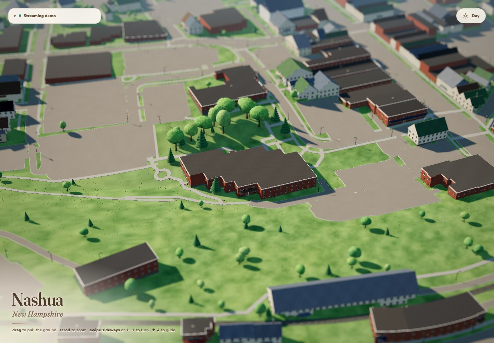

# TinyTown Nashua

Downtown **Nashua, New Hampshire, USA**, built with [Koomen’s TinyTown](https://github.com/koomen/tinytown) using its documented “Make your own town” pipeline. This is a public fork, with the original renderer and authoring tools preserved.

The first area is **1.6 × 1.6 km**, centered at **42.7615, -71.4670**, around Main Street and the Nashua River. It contains **2,253 mapped buildings**, **2,190 road/path pieces**, and USGS terrain. The goal is to expand to the entire city after measuring larger areas.

This first pass uses real map footprints and procedural building appearances. It does **not** yet have the photograph-informed, individually authored buildings that give the original Avon miniature its extra detail. The original reference/authoring pipeline is included for that next step.



## Public website

[Nashua miniature](https://hjoshi7.github.io/tinytown-nashua/) is hosted on GitHub Pages. The homepage selects streaming and the downtown starting view automatically. Add `?tiles=1` to show the optional streaming diagnostics.

To republish after committing a map update:

```sh
python3 scripts/publish-pages.py
```

This runs the upstream staging checks and pushes only the static website to `gh-pages`; GitHub Pages publishes that branch. It keeps the source checkout on `main`. `scripts/stage-pages.py` can prepare the Pages bundle without publishing.

## Run it

Python 3.10+; Node 22+ for baking and tests. The viewer needs internet access for its pinned Three.js CDN modules.

The upstream examples contain large generated assets. A sparse clone gets everything needed for Nashua without downloading those examples:

```sh
git clone --depth 1 --filter=blob:none --sparse https://github.com/hjoshi7/tinytown-nashua.git
cd tinytown-nashua
git sparse-checkout set tinytown src sites docs tests scripts data/nashua
python3 -m venv .venv
.venv/bin/pip install -e .
./town serve
```

Open **http://localhost:8734/?site=nashua&stream=1&focus=32285517&dist=450** for the baked streaming view. TinyTown shows its streaming diagnostics with this explicit flag. The initial link focuses on the Nashua Public Library by the river; drag and zoom to explore. The default root also selects Nashua; without `stream=1`, upstream uses its original in-browser generator for newly added towns, which is slower on this dense scene.

You can also use a normal full clone. Nashua’s baked data is committed, so viewing does not require re-fetching maps, a model account, or installing the private browser.

## Reproduce the miniature

These are the upstream commands, with Nashua’s coordinates and name:

```sh
./town browser setup
./town fetch nashua --center 42.7615,-71.4670 --size 1600,1600 --title "Nashua, New Hampshire"
./town build nashua
./town bake nashua
./town bake nashua --check
./town stage --target nashua
./town serve --dist nashua
```

Open http://localhost:8734/?stream=1 when serving the staged target. Fetching is cached and resumable. On an existing clone, `fetch` downloads any missing local reference imagery; `--force` deliberately refreshes source data, so a future refresh may reflect newer OpenStreetMap edits.

This fork started from upstream commit `e7146e2f210d245b5dc952b2f37f267ee20cb68b`. The display title is set in `data/nashua/overrides.json`, as required by the upstream builder. Source requests and public geographic inputs are committed under `data/nashua/source/`. Third-party aerial and Street View reference images stay local and are excluded from Git and staged assets.

## Improve building detail

Follow [the original pipeline guide](docs/pipeline.md) and [authoring policy](docs/authoring.md). Start with a few buildings before running the whole area:

```sh
./town plan nashua --limit 5 --out queue.txt
./town refs nashua --list queue.txt
./town author nashua --dry-run
```

Authoring requires an authenticated Codex CLI and consumes model usage. Select the desired building IDs from the queue and use `town author nashua ID --accept` with explicit token/time limits. After accepted changes, build and bake again. `town scope` is optional: a configured strict scope requires every included building to have an accepted blueprint before staging, so this procedural first pass uses the fetch boundary instead.

## Grow toward the full city

Keep the current center and enlarge `--size` in measured steps using `town fetch ... --force`, then rebuild and bake. Existing IDs can retain their authored models. For actual city-wide coverage, obtain and verify Nashua’s municipal boundary, rather than treating a large rectangle as the city limits.

TinyTown already streams detail near the camera. Full-city performance is **not yet verified**: coarse regions can accumulate while exploring, and terrain, geometry, download size, and authoring work all grow with the area. Keep downtown as a working baseline and measure a wider area before replacing it. See [rendering and streaming](docs/rendering.md).

## Verification

See [the validation record](docs/nashua-validation.md) for the checked data, generated assets, and browser behavior. The upstream full regression suite requires the original example fixtures as well as Nashua, so run it from a full checkout or restore those fixture paths when using a sparse clone.

## Upstream and credits

- [Original README](docs/upstream-readme.md), [architecture](docs/ARCHITECTURE.md), and [pipeline](docs/pipeline.md).
- Code: MIT, retaining the original [LICENSE](LICENSE).
- Map data: © [OpenStreetMap contributors](https://www.openstreetmap.org/copyright), ODbL 1.0. Derived data under `data/` is available under ODbL 1.0.
- Terrain: U.S. Geological Survey, 3D Elevation Program (public domain).
- Reference imagery: Esri World Imagery, used locally; not redistributed.
- Original TinyTown design and implementation: [Koomen](https://github.com/koomen/tinytown).

This is an independent miniature project, not an official City of Nashua product. The public website is served from the `gh-pages` branch of this repository.
